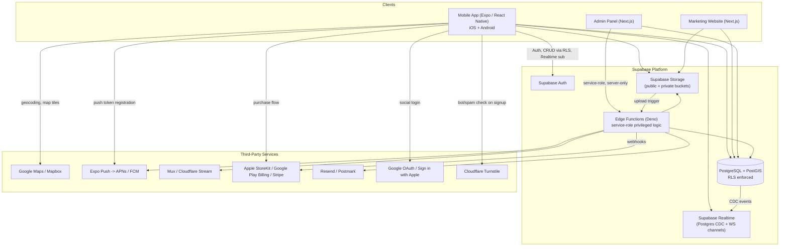

# 01 — Technology Stack & System Architecture

## 1. Technology Stack

### Mobile (primary product)
| Layer | Choice | Why |
|---|---|---|
| Framework | **React Native + Expo (EAS Build)**, TypeScript strict | Single codebase for iOS/Android, mature ecosystem for camera/media/maps/push/deep-links/IAP; EAS removes most native-build pain. Fully appropriate for every capability the client needs — see evaluation below. |
| Navigation | **Expo Router** (file-based, built on React Navigation) | Native deep-linking and typed routes out of the box; matches the tab/stack/modal hierarchy needed (§ Navigation doc). |
| State (server) | **TanStack Query (React Query)** | Caching, pagination, optimistic updates, background refetch — ideal for feed/messages/search. |
| State (client/UI) | **Zustand** | Lightweight, no boilerplate, good for auth session, composer drafts, filters. |
| Forms/validation | **React Hook Form + Zod** | Type-safe schemas shared with backend validation. |
| Realtime | **Supabase Realtime** (Postgres logical replication + WebSocket channels) | Native fit with Supabase Postgres; used for messaging, presence, live notification badges. |
| Maps | **react-native-maps** (Google Maps provider on both platforms) — see §12 for Mapbox trade-off | Native performance, clustering libs available, cheaper at this scale than Mapbox for standard styling needs, but see the recommendation write-up in `05-search-map.md` for the final call and cost model. |
| Media | **expo-image-picker / expo-camera**, **expo-av** or **expo-video** for playback, background upload via `expo-file-system` + resumable upload to Supabase Storage | Native camera/gallery access, resumable large-video upload. |
| Auth (client) | **Supabase Auth JS**, `expo-apple-authentication`, `expo-auth-session` (Google) | Native Sign in with Apple (mandatory on iOS when other social login exists), Google OAuth. |
| Push | **Expo Notifications** → APNs/FCM via Expo Push Service (or direct FCM/APNs if scale requires) | Simplifies cross-platform push; can migrate to direct FCM/APNs later without app-code changes. |
| Payments | **react-native-iap** (StoreKit 2 / Google Play Billing v6) + Stripe (web only) | Required for App Store/Play Store subscription compliance — digital subscriptions to app features must use native IAP, not Stripe, on mobile. |
| i18n | **i18next + react-i18next**, `expo-localization` | Namespace-based translation files, RO/EN at launch, pluralization support for future languages. |
| Design system | Custom component library in `packages/ui` (Tailwind-equivalent via `nativewind` or a themed style system) | See `04-mobile.md` for full design system. |

**Expo + React Native — capability evaluation (client asked this explicitly):**
- iOS/Android: ✅ single codebase, EAS Build handles native signing/build pipelines for both stores.
- Push notifications: ✅ via Expo Notifications, or eject to bare workflow later if custom native push handling is needed — not expected here.
- Camera/photo/video upload: ✅ `expo-image-picker`, `expo-camera`, resumable uploads to Supabase Storage.
- Maps: ✅ `react-native-maps` works in Expo (config plugin, no eject needed since SDK 49+).
- Deep links: ✅ native support via Expo Router + universal links/App Links config.
- Auth (Apple/Google): ✅ first-class Expo modules exist; both required in this project (Apple mandatory alongside Google on iOS App Store).
- Subscriptions/IAP: ⚠️ requires a **development build / EAS build** (not Expo Go) because `react-native-iap` needs native modules — flag this explicitly for the coding agent: **the app cannot ship IAP-testable builds through Expo Go; a dev client is required from the moment payments work begins.**
- File uploads: ✅ standard.
- Realtime messaging: ✅ Supabase Realtime client works over WebSocket, no native module needed.

Conclusion: Expo (managed workflow + EAS dev builds, not Expo Go for production/testing subscriptions) is appropriate for 100% of required capabilities.

### Backend
| Layer | Choice | Why |
|---|---|---|
| Platform | **Supabase** (hosted Postgres + Auth + Storage + Realtime + Edge Functions) | Gives Postgres (relational integrity needed for follows/likes/messaging/reviews), built-in RLS for the heavy multi-role security model, Realtime for chat, Storage with signed URLs for private verification docs, and Edge Functions (Deno) for anything requiring service-role privilege (webhooks, receipt validation, moderation actions). Avoids building a bespoke API layer for CRUD Supabase already does safely via RLS. |
| Database | **PostgreSQL 15+ with PostGIS** extension | PostGIS required for map/location queries (`ST_DWithin`, radius search) and for `pg_trgm`/full-text search for the search feature. |
| Search | **Postgres full-text search (`tsvector`) + `pg_trgm`** for MVP; evaluate **Meilisearch/Typesense** as a dedicated search service once catalog size or query complexity outgrows Postgres (see `05-search-map.md`) | Avoids introducing a second datastore before it's needed; both `tsvector` and `pg_trgm` handle prefix/fuzzy Romanian-language queries like "Implantologie Galați" adequately at MVP scale. |
| Server logic requiring elevated privilege | **Supabase Edge Functions (Deno/TypeScript)** | Webhook receivers (App Store/Play/Stripe), verification document access grants, admin actions, notification dispatch, moderation actions, receipt validation — anything that must bypass or supersede RLS safely. |
| File/media storage | **Supabase Storage** (S3-compatible), separate buckets per sensitivity class | Public buckets for portfolio/feed/avatars (CDN-cacheable), private buckets (signed-URL-only) for verification docs and message attachments. |
| Video processing | **Mux** or **Cloudflare Stream** (external) triggered via Edge Function on upload | Postgres/Supabase Storage is not a transcoding service; adaptive bitrate + thumbnail generation needs a dedicated pipeline. |
| Push delivery | **Expo Push Service** → APNs/FCM | Matches mobile client choice. |
| Email | **Resend** or **Postmark** via Edge Function | Transactional email (verification, password reset, notification digests). |

### Web (marketing site + Admin Panel)
| Layer | Choice | Why |
|---|---|---|
| Framework | **Next.js 14+ (App Router), TypeScript** | SSR/SSG for the marketing site (SEO matters for clinic/lab discovery), same framework serves the Admin Panel with route groups and role-gated middleware. |
| Styling | **Tailwind CSS** + shared design tokens from `packages/ui` | Fast iteration, consistent tokens with mobile app (translated from React Native theme to CSS variables). |
| Admin data layer | Supabase JS client with **service-role key used only server-side** (Next.js Route Handlers / Server Actions), never exposed to browser | Enforces that admin privilege bypass never reaches the client bundle. |
| Auth (admin) | Supabase Auth with a dedicated `admin_users` table and **separate login flow**, MFA required | Prevents privilege confusion with the consumer app's auth session model. |

## 2. System Architecture Diagram



**Communication rules:**
- Mobile/Web clients talk to Postgres **directly through the Supabase client SDK**, protected entirely
  by RLS policies (no bespoke REST/GraphQL API layer for standard CRUD — this is the "cleanest
  architecture" called for in client-spec-adjacent §28 of the master prompt).
- Anything requiring privilege beyond the requesting user's own RLS grants (webhook processing,
  cross-user notification writes, verification document access grants, admin actions, moderation)
  goes through an **Edge Function using the service-role key**, never exposed to any client.
- Realtime subscriptions are scoped by RLS too — a client can only subscribe to rows it could
  otherwise `SELECT`.

## 3. Repository Structure — Monorepo

**Recommendation: Turborepo monorepo.** Rationale: mobile, web marketing, and admin panel share
types (domain models), a design-token-derived UI language, i18n strings, and Supabase client
config/generated types. A monorepo keeps these in lockstep and lets one PR update a schema type and
all three consumers atomically; the Supabase project (DB/migrations) is the shared source of truth
regardless.

```
dental-platform/
├── apps/
│   ├── mobile/                 # Expo React Native app
│   │   ├── app/                 # Expo Router routes (see 04-mobile.md)
│   │   ├── src/
│   │   │   ├── features/        # feature modules (auth, feed, messaging, ...)
│   │   │   ├── components/      # app-specific composed components
│   │   │   ├── hooks/
│   │   │   ├── services/        # Supabase queries, API wrappers
│   │   │   ├── stores/          # Zustand stores
│   │   │   ├── lib/             # supabase client, query client, i18n init
│   │   │   ├── constants/
│   │   │   └── assets/
│   │   ├── app.config.ts
│   │   └── eas.json
│   ├── web/                    # Next.js marketing site
│   │   └── app/
│   └── admin/                  # Next.js admin panel
│       └── app/
├── packages/
│   ├── ui/                     # shared design-system components (RN + web variants)
│   ├── types/                  # generated Supabase types + shared domain types (TS)
│   ├── config/                 # eslint, tsconfig, tailwind preset, design tokens (JSON)
│   ├── api/                    # typed query/mutation functions shared by apps (Supabase client wrappers)
│   └── i18n/                   # shared translation resources (ro.json, en.json, ...)
├── supabase/
│   ├── migrations/             # SQL migrations (source of truth for schema)
│   ├── functions/              # Edge Functions (Deno)
│   └── seed.sql
├── docs/                       # this documentation set
├── turbo.json
└── package.json
```

**Why not separate repos:** three frontends consuming one Postgres schema is the exact case where
type drift causes production bugs (e.g., a `clinics` column rename breaking the admin panel
silently). A monorepo with `packages/types` generated from `supabase gen types typescript` and
consumed by all three apps eliminates that class of bug and matches the master prompt's requirement
that "the coding agent... reuse existing components... avoid duplicated business logic."

## 4. Environments

| Environment | Supabase project | Purpose | Access |
|---|---|---|---|
| Development | `dental-dev` | Local/dev builds, seeded fake data | All developers |
| Staging | `dental-staging` | Pre-release QA, App Store/Play internal testing tracks, sandbox IAP | QA + reviewers |
| Production | `dental-prod` | Live app | Restricted, service-role key only in server-side secrets |

Each environment is a **fully separate Supabase project** (not schemas within one project) so that
staging data, staging Storage buckets, and staging Auth users can never leak into or collide with
production, and so that migrations can be tested end-to-end in staging before being applied to
production. Environment variables (`SUPABASE_URL`, `SUPABASE_ANON_KEY`, `SUPABASE_SERVICE_ROLE_KEY`,
payment sandbox keys, maps API keys) are injected via EAS Secrets (mobile) and Vercel/hosting env
vars (web/admin) — never committed, never hardcoded (see `15-ai-agent-instructions.md`).
