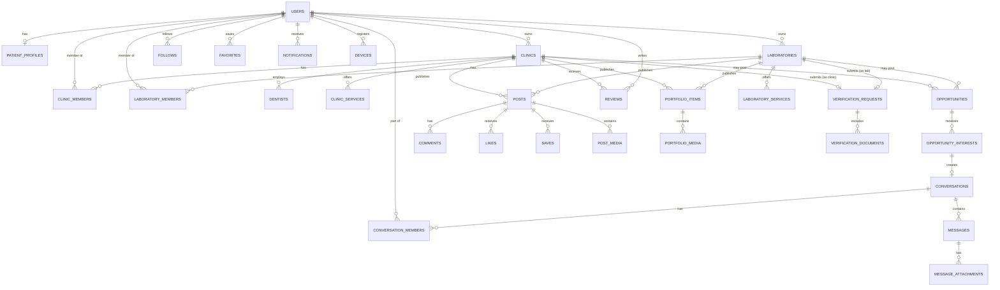

# 02 — Database Architecture (PostgreSQL / Supabase)

Conventions used throughout:
- All primary keys: `id uuid primary key default gen_random_uuid()`.
- All tables: `created_at timestamptz not null default now()`, `updated_at timestamptz not null default now()` (maintained via trigger).
- Soft delete: tables that are user-facing content use `deleted_at timestamptz null` (soft delete) so moderation/audit history is preserved; pure join/state tables use hard delete.
- `owner_user_id` pattern: every organization entity (clinic, laboratory) is owned by the `users` row that created it, with additional `clinic_members`/`laboratory_members` for team access — this is what makes multi-admin clinic accounts possible without duplicating auth identities.

## 1. Core Identity & Profiles

### `users` (extends `auth.users` — 1:1 shadow table)
| Column | Type | Notes |
|---|---|---|
| id | uuid PK | = `auth.users.id` (FK, not a separate identity) |
| account_type | enum(`patient`,`clinic`,`laboratory`) | **immutable** after first set (enforced by trigger, not just app logic) |
| email | text unique | mirrors `auth.users.email` for query convenience |
| phone | text unique null | |
| locale | text default 'ro' | |
| status | enum(`active`,`suspended`,`deleted`) default `active` | |
| last_seen_at | timestamptz null | for online-status feature |
| created_at, updated_at, deleted_at | timestamptz | |

Indexes: unique(email), unique(phone), btree(account_type).

### `patient_profiles`
| Column | Type | Notes |
|---|---|---|
| user_id | uuid PK, FK → users.id | |
| first_name, last_name | text | |
| city | text null | |
| avatar_url | text null | points to Storage path, public bucket |
| created_at, updated_at | timestamptz | |

### `clinics`
| Column | Type | Notes |
|---|---|---|
| id | uuid PK | |
| owner_user_id | uuid FK → users.id, not null | account creator; must have `account_type = clinic` |
| name | text not null | |
| slug | text unique not null | for public URLs |
| description | text null | |
| logo_url, cover_url | text null | Storage paths, public bucket |
| address, city, county, country | text | country default 'RO' |
| location | geography(Point,4326) | PostGIS — required for map/radius search |
| phone, email, website | text null | |
| instagram, facebook, tiktok | text null | |
| working_hours | jsonb null | `{mon:{open,close}, ...}` |
| open_for_collaboration | boolean default false | |
| collaboration_note | text null | "Căutăm laborator pentru colaborare" free text |
| is_verified | boolean default false | denormalized from `verification_requests` for fast filtering |
| rating_avg | numeric(3,2) default 0 | denormalized, recalculated by trigger on `reviews` change |
| rating_count | int default 0 | |
| plan | enum(`free`,`pro`) default `free` | denormalized from `subscriptions` for fast entitlement checks |
| status | enum(`active`,`suspended`,`deleted`) default `active` | |
| created_at, updated_at, deleted_at | timestamptz | |

Indexes: gist(location) [PostGIS radius queries], btree(city), btree(is_verified), btree(open_for_collaboration), gin(to_tsvector('simple', name || ' ' || description)) [full-text search], unique(slug).

### `laboratories`
| Column | Type | Notes |
|---|---|---|
| id | uuid PK | |
| owner_user_id | uuid FK → users.id, not null | |
| name, slug | text | unique(slug) |
| description | text null | |
| logo_url, cover_url | text null | |
| address, city, county, country | text | |
| location | geography(Point,4326) | |
| phone, email, website | text null | |
| instagram, facebook, tiktok | text null | |
| years_experience | int null | |
| team_size | int null | |
| collaboration_zone | enum(`local`,`national`,`european`,`international`) | |
| open_for_collaboration | boolean default false | |
| collaboration_note | text null | |
| is_verified | boolean default false | |
| rating_avg, rating_count | numeric/int | reserved for future lab reviews (client §20, later phase) |
| plan | enum(`free`,`pro`) default `free` | |
| status | enum(`active`,`suspended`,`deleted`) default `active` | |
| created_at, updated_at, deleted_at | timestamptz | |

Indexes: same pattern as `clinics`.

### `clinic_members` / `laboratory_members`
Team access to an organization account (owner + admins/editors who can manage the profile —
distinct from `dentists`, which is public-facing team **display**, not login access).

| Column | Type | Notes |
|---|---|---|
| id | uuid PK | |
| clinic_id (or laboratory_id) | uuid FK, not null | |
| user_id | uuid FK → users.id, not null | |
| role | enum(`owner`,`admin`,`editor`) | owner = creator, cannot be removed without transfer |
| created_at | timestamptz | |

Unique(clinic_id, user_id).

### `dentists`
Public-facing team roster shown on a clinic profile (client §4). Not a login identity.

| Column | Type | Notes |
|---|---|---|
| id | uuid PK | |
| clinic_id | uuid FK → clinics.id, not null | |
| full_name | text not null | |
| photo_url | text null | |
| specialization | enum/text (see `specializations` table) | |
| description | text null | |
| years_experience | int null | |
| instagram, facebook | text null | |
| display_order | int default 0 | |
| created_at, updated_at, deleted_at | timestamptz | |

Index: btree(clinic_id).

### `specializations` (reference/catalog table)
| id (uuid) | key (text unique, e.g. `implantology`) | label_ro | label_en | icon | active (bool) |

Seeded with client's list (Stomatologie generală, Implantologie, Protetică, Ortodonție, Endodonție,
Chirurgie orală, Parodontologie, Pedodonție, Estetică dentară — extensible).

## 2. Services & Portfolio

### `services` (global catalog, admin-curated)
| id (uuid) | key (text unique) | label_ro | label_en | category (enum: `clinic`,`laboratory`,`both`) | icon | active (bool) |

Seeded with client's clinic list (Consultație, Implant, All-on-4/6, Fațete, Coroane
zirconiu/ceramică, Albire, Ortodonție, Endodonție, Chirurgie, Igienizare) and lab list (Zirconiu,
E.max, Fațete, Metaloceramică, Implantologie, All-on-X, Proteze, CAD/CAM, Design digital, Full
Contour, Bară titan, PMMA, Wax-up).

### `clinic_services` / `laboratory_services` (instance — an org offering a catalog service)
| Column | Type | Notes |
|---|---|---|
| id | uuid PK | |
| clinic_id (or laboratory_id) | uuid FK | |
| service_id | uuid FK → services.id | |
| custom_title | text null | overrides catalog label if org wants custom naming |
| description | text null | |
| image_url | text null | |
| price_from | numeric null | optional, per client spec ("Preț opțional") |
| currency | text default 'RON' | |
| display_order | int default 0 | |
| created_at, updated_at | timestamptz | |

Unique(clinic_id, service_id) / unique(laboratory_id, service_id).

### `portfolio_items`
Shared table for both clinic and laboratory portfolios (polymorphic owner — see rationale below).

| Column | Type | Notes |
|---|---|---|
| id | uuid PK | |
| owner_type | enum(`clinic`,`laboratory`) | |
| owner_id | uuid | FK enforced via trigger (not native FK, since it targets two possible tables) |
| title | text null | case title |
| description | text null | case description |
| category | text | FK-like reference to a `portfolio_categories` catalog (Implantologie, Estetică, Fațete, All-on-X, Ortodonție, Full Mouth Rehab / Anterior, Posterior, Zirconiu, E.max, Full Mouth for labs) |
| is_before_after | boolean default false | |
| status | enum(`published`,`draft`,`removed`) default `published` | |
| created_at, updated_at, deleted_at | timestamptz | |

Indexes: btree(owner_type, owner_id), btree(category), gin(to_tsvector(title||description)).

**Why polymorphic instead of two separate tables (`clinic_portfolio_items` /
`laboratory_portfolio_items`):** the feed, search, and moderation systems all need to treat
portfolio items generically; a single table with `owner_type`/`owner_id` avoids duplicating every
downstream query, index, and RLS policy. The trade-off (no native FK integrity on `owner_id`) is
mitigated with a `BEFORE INSERT/UPDATE` trigger that validates the referenced row exists in the
correct table. This same polymorphic pattern is reused for `favorites`, `follows` (target side),
`likes`, `comments`, `saves`, and `reports` — see §5.

### `portfolio_media`
| Column | Type | Notes |
|---|---|---|
| id | uuid PK | |
| portfolio_item_id | uuid FK → portfolio_items.id, not null | |
| media_type | enum(`image`,`video`) | |
| storage_path | text not null | Supabase Storage path (public portfolio bucket) |
| video_playback_url | text null | Mux/Cloudflare Stream URL once transcoded |
| thumbnail_url | text null | |
| before_after_role | enum(`before`,`after`,`single`) default `single` | |
| display_order | int default 0 | |
| created_at | timestamptz | |

Index: btree(portfolio_item_id).

## 3. Feed

### `posts`
| Column | Type | Notes |
|---|---|---|
| id | uuid PK | |
| author_type | enum(`clinic`,`laboratory`) | patients cannot author posts per spec |
| author_id | uuid | polymorphic, trigger-validated |
| post_type | enum(`photo`,`video`,`text`,`portfolio`,`announcement`,`collaboration`) | |
| content | text null | |
| linked_portfolio_item_id | uuid FK → portfolio_items.id null | when post_type = `portfolio` |
| linked_opportunity_id | uuid FK → opportunities.id null | when post_type = `collaboration` |
| status | enum(`published`,`removed`,`flagged`) default `published` | `flagged` set by moderation, hides from public feed pending review |
| like_count, comment_count, save_count, share_count | int default 0 | denormalized counters, trigger-maintained |
| created_at, updated_at, deleted_at | timestamptz | |

Indexes: btree(author_type, author_id), btree(created_at desc) [feed pagination], btree(status).

### `post_media`
Same shape as `portfolio_media` but FK to `posts.id`.

## 4. Social Graph — Follow / Like / Comment / Save / Favorite

### `follows`
| Column | Type | Notes |
|---|---|---|
| id | uuid PK | |
| follower_user_id | uuid FK → users.id, not null | |
| target_type | enum(`clinic`,`laboratory`,`dentist`) | |
| target_id | uuid | trigger-validated |
| created_at | timestamptz | |

Unique(follower_user_id, target_type, target_id). Index: btree(target_type, target_id) [followers list], btree(follower_user_id) [following list].

### `likes`
| id (uuid) | user_id FK | target_type enum(`post`,`comment`) | target_id uuid | created_at |

Unique(user_id, target_type, target_id).

### `comments`
| Column | Type | Notes |
|---|---|---|
| id | uuid PK | |
| post_id | uuid FK → posts.id, not null | |
| author_user_id | uuid FK → users.id, not null | any account type may comment |
| parent_comment_id | uuid FK → comments.id null | 1-level reply support |
| content | text not null | |
| status | enum(`visible`,`removed`) default `visible` | |
| like_count | int default 0 | |
| created_at, updated_at, deleted_at | timestamptz | |

Index: btree(post_id, created_at).

### `saves`
| id (uuid) | user_id FK | post_id FK → posts.id | created_at |

Unique(user_id, post_id). (Distinct from `favorites`, which targets entities/profiles, not feed
posts — see rationale below.)

### `favorites`
| Column | Type | Notes |
|---|---|---|
| id | uuid PK | |
| user_id | uuid FK → users.id, not null | the saving user (works identically whether the acting account is patient, clinic, or lab — client §18 wants patients saving clinics/dentists/posts, clinics saving labs/dentists/posts, labs saving clinics/posts) |
| target_type | enum(`clinic`,`laboratory`,`dentist`,`post`) | |
| target_id | uuid | trigger-validated |
| created_at | timestamptz | |

Unique(user_id, target_type, target_id).

**Design decision — `saves` vs `favorites`:** the client spec lists "Save" as a feed-post
interaction (§15) *and* "Favorites" as a separate broader save-list feature covering
clinics/dentists/posts (§18). Rather than force these into one ambiguous table, `saves` is kept as
the lightweight feed-interaction counter (drives `posts.save_count`), while `favorites` is the
general-purpose "my saved list" the Favorites screen reads from — a saved post exists in **both**
tables by design (an Edge trigger keeps them in sync so the UI doesn't need two separate calls).
This is documented explicitly because it is the one place the spec's terminology is ambiguous
(flagged per the master prompt's instruction to surface ambiguity rather than silently resolve it).

## 5. Opportunities / Collaboration

### `opportunities`
| Column | Type | Notes |
|---|---|---|
| id | uuid PK | |
| author_type | enum(`clinic`,`laboratory`) | either side can post (client §11) |
| author_id | uuid | trigger-validated |
| title | text not null | |
| description | text not null | |
| city | text null | |
| specialization | text null | free text or FK to `specializations`/`services` |
| status | enum(`open`,`closed`,`filled`,`cancelled`) default `open` | |
| created_at, updated_at, deleted_at | timestamptz | |

Index: btree(author_type, author_id), btree(status), btree(city), gin(to_tsvector(title||description)).

### `opportunity_interests`
| Column | Type | Notes |
|---|---|---|
| id | uuid PK | |
| opportunity_id | uuid FK → opportunities.id, not null | |
| responder_type | enum(`clinic`,`laboratory`) | |
| responder_id | uuid | trigger-validated; **must be the opposite type from the opportunity author** where the workflow implies a cross-side match (enforced in application/Edge Fn logic, not DB constraint, since clinic↔clinic and lab↔lab collaboration is also plausible per §16 wording) |
| status | enum(`pending`,`accepted`,`rejected`,`withdrawn`) default `pending` | |
| conversation_id | uuid FK → conversations.id null | populated once accepted and a conversation is created |
| created_at, updated_at | timestamptz | |

Unique(opportunity_id, responder_type, responder_id) — **prevents duplicate applications**
explicitly called out in the client spec. Index: btree(opportunity_id), btree(responder_type, responder_id).

State machine: `pending → accepted | rejected | withdrawn`. Transition to `accepted` triggers Edge
Function creating/reusing a `conversations` row between the two organizations and firing a
notification.

## 6. Messaging

### `conversations`
| Column | Type | Notes |
|---|---|---|
| id | uuid PK | |
| type | enum(`direct`) | reserved enum for future group support, direct-only for MVP |
| origin | enum(`manual`,`opportunity`) default `manual` | tracks whether it was opened by user action or an accepted opportunity interest |
| last_message_at | timestamptz null | denormalized for conversation-list sort |
| created_at | timestamptz | |

### `conversation_members`
| id (uuid) | conversation_id FK | user_id FK | acting_as_type enum(`patient`,`clinic`,`laboratory`) | acting_as_id uuid (self if patient, else clinic/lab id) | last_read_at timestamptz null | created_at |

Unique(conversation_id, user_id). Two rows per conversation (direct messages only). `acting_as_id`
captures which organization the user was representing (important when a user is a
`clinic_members` editor rather than the owner).

### `messages`
| Column | Type | Notes |
|---|---|---|
| id | uuid PK | |
| conversation_id | uuid FK → conversations.id, not null | |
| sender_user_id | uuid FK → users.id, not null | |
| content | text null | nullable when message is attachment-only |
| status | enum(`sent`,`deleted`) default `sent` | soft-delete for "delete for me/everyone" if added later |
| created_at | timestamptz | |
| seen_at | timestamptz null | set when the *other* member reads it (per-conversation-member seen tracking actually needs a join table if 1:1 isn't guaranteed forever — acceptable simplification for direct-only MVP) |

Index: btree(conversation_id, created_at) [pagination], btree(sender_user_id).

### `message_attachments`
| id (uuid) | message_id FK | type enum(`image`,`file`) | storage_path (private bucket) | file_name | file_size_bytes | mime_type | created_at |

## 7. Reviews

### `reviews`
| Column | Type | Notes |
|---|---|---|
| id | uuid PK | |
| clinic_id | uuid FK → clinics.id, not null | patient→clinic only for MVP (client §20) |
| patient_user_id | uuid FK → users.id, not null | |
| rating | smallint not null check (rating between 1 and 5) | |
| communication_rating, professionalism_rating, experience_rating | smallint null check (1-5) | optional category breakdown |
| comment | text null | |
| status | enum(`visible`,`hidden_by_admin`,`flagged`) default `visible` | |
| created_at, updated_at | timestamptz | |

Unique(clinic_id, patient_user_id) — **one review per patient per clinic**, satisfying
"anti-spam/duplicate prevention." A trigger recalculates `clinics.rating_avg`/`rating_count` on
insert/update/delete where `status = visible`.

**Deletion behavior (confirmed, see `16-client-decisions-mvp-scope-update.md` §7):** when a patient
requests deletion of their own review, the row is **hard-deleted** (not anonymized/retained) and
the `AFTER DELETE` trigger recalculates `clinics.rating_avg`/`rating_count` without it. No
anonymization column is needed on this table.

## 8. Verification

### `verification_requests`
| Column | Type | Notes |
|---|---|---|
| id | uuid PK | |
| subject_type | enum(`clinic`,`laboratory`) | |
| subject_id | uuid | trigger-validated |
| status | enum(`pending`,`approved`,`rejected`) default `pending` | |
| reviewed_by_admin_id | uuid FK → admin_users.id null | |
| review_note | text null | |
| submitted_at, reviewed_at | timestamptz null | |

Index: btree(subject_type, subject_id), btree(status).

### `verification_documents`
| id (uuid) | verification_request_id FK | storage_path (private bucket, **admin-only**) | document_type (enum: `business_license`,`professional_certificate`,`id_document`,`other`) | uploaded_at |

## 9. Notifications & Devices

### `notifications`
| Column | Type | Notes |
|---|---|---|
| id | uuid PK | |
| user_id | uuid FK → users.id, not null | recipient |
| type | enum(`new_follower`,`new_like`,`new_comment`,`new_message`,`collaboration_request`,`opportunity_response`,`verification_approved`,`new_review`) | |
| actor_type, actor_id | polymorphic, nullable | who/what triggered it |
| target_type, target_id | polymorphic, nullable | deep-link target (post, conversation, opportunity...) |
| body | text null | precomposed display text (denormalized for i18n snapshot at send time, or a translation key + params jsonb) |
| read_at | timestamptz null | |
| created_at | timestamptz | |

Index: btree(user_id, created_at desc), btree(user_id, read_at).

### `notification_preferences`
| user_id PK/FK | new_follower bool default true | new_like bool default true | new_comment bool default true | new_message bool default true | collaboration_request bool default true | opportunity_response bool default true | verification_approved bool default true | new_review bool default true |

### `devices`
| id (uuid) | user_id FK | push_token text | platform enum(`ios`,`android`) | last_active_at timestamptz | created_at |

Unique(push_token).

## 10. Blocking & Reporting

### `blocked_users`
| id (uuid) | blocker_user_id FK | blocked_user_id FK | created_at |

Unique(blocker_user_id, blocked_user_id). Enforced check: blocker ≠ blocked.

### `reports`
| Column | Type | Notes |
|---|---|---|
| id | uuid PK | |
| reporter_user_id | uuid FK → users.id, not null | never exposed to the reported party |
| target_type | enum(`profile_clinic`,`profile_laboratory`,`post`,`comment`,`message`,`review`) | |
| target_id | uuid | trigger-validated |
| reason | enum(`spam`,`fake_account`,`offensive_content`,`scam`,`inappropriate_content`,`other`) | |
| note | text null | |
| status | enum(`open`,`reviewing`,`resolved_actioned`,`resolved_dismissed`) default `open` | |
| resolved_by_admin_id | uuid FK → admin_users.id null | |
| created_at, resolved_at | timestamptz | |

Index: btree(target_type, target_id), btree(status).

## 11. Platform Limits (MVP) — Subscriptions & Payments deferred

**Confirmed by client (`16-client-decisions-mvp-scope-update.md` §5): the app is 100% free for the
first ~6–12 months.** No PRO plan, no payment processing, no `subscriptions`/`subscription_events`/
`payments` tables exist in the MVP/V1 migration set — that schema is fully specified in
`09-subscriptions-payments.md` for when the monetization phase begins, but is **not created now**.
`clinics.plan`/`laboratories.plan` columns from earlier drafts of this schema are likewise **not
included** in the MVP migrations.

Instead, MVP applies flat, non-commercial, anti-spam technical limits to every account equally:

### `platform_limits`
| Column | Type | Notes |
|---|---|---|
| key | text PK | e.g. `max_portfolio_media_per_item`, `max_active_opportunities` |
| value | int not null | |

Seed data: `('max_portfolio_media_per_item', 25)`, `('max_active_opportunities', 5)` — the "25" is
a settled default within the client's stated 20–30 range; confirm exact number before Phase 7.

Enforced via `BEFORE INSERT` triggers:
- On `portfolio_media`: reject insert if it would push the parent `portfolio_item_id`'s media count
  past `max_portfolio_media_per_item`.
- On `opportunities`: reject insert of a new `open`-status row if the author org already has
  `max_active_opportunities` rows with `status='open'`.

Both limits are config-driven (table-backed, not hardcoded in application code) specifically so
they can be tuned without a redeploy, per the same principle originally applied to plan limits.

When the monetization phase begins, `subscriptions`/`subscription_events`/`payments` and
`clinics.plan`/`laboratories.plan` are added via new migrations exactly as specified in
`09-subscriptions-payments.md`, and `platform_limits` is either extended with plan-aware variants
or superseded by the `plan_limits` table described there — a decision to make at that time, not now.

## 12. Admin

### `admin_users`
Separate from `users` entirely — admins are not platform end-users.

| id (uuid) | email unique | role enum(`super_admin`,`moderator`,`support`) | mfa_enabled bool | created_at | last_login_at |

### `audit_logs`
| id (uuid) | admin_id FK → admin_users.id | action text | target_type text | target_id uuid | before jsonb | after jsonb | created_at |

Every admin write (ban, delete, verification decision, refund, etc.) must insert here — enforced
by convention in every admin Edge Function, not by trigger (since admin actions span many tables).

## 13. GDPR / Compliance

### `consent_records`
| id (uuid) | user_id FK | consent_type enum(`terms`,`privacy_policy`,`marketing`) | version text | accepted_at timestamptz |

### `data_export_requests`
| id (uuid) | user_id FK | status enum(`pending`,`processing`,`ready`,`expired`) | file_storage_path text null (private, expiring) | requested_at | completed_at | expires_at |

## 14. Full ERD

See `03-security.md` companion diagram and the dedicated Mermaid ERD below covering the primary
relationships.

*(SUBSCRIPTIONS/PAYMENTS entities and relationships omitted from the MVP ERD — deferred to the
monetization phase per `16-client-decisions-mvp-scope-update.md` §5; see `09-subscriptions-payments.md`
for that future schema.)*

## 15. Notes on Denormalization

Deliberate denormalization (with trigger-maintained consistency) is used for: `rating_avg`/
`rating_count` on `clinics`, `like_count`/`comment_count`/`save_count`/`share_count` on `posts`,
`plan` mirrored onto `clinics`/`laboratories`, and `last_message_at` on `conversations`. These are
all high-read, low-write-frequency-relative-to-read aggregates where a live `COUNT(*)` join would
not scale past a few thousand rows; every one of them has a single well-defined trigger as source of
truth, never computed ad-hoc in application code, to avoid drift.
