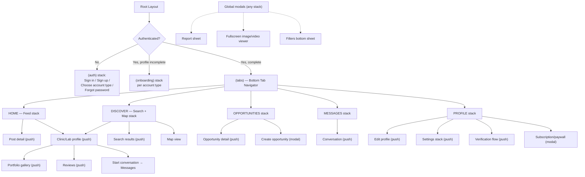

# 04 — Mobile Architecture, Navigation & Design System

## 1. App Structure (inside `apps/mobile`)

```
apps/mobile/
├── app/                          # Expo Router — file-based routes (navigation shell only)
│   ├── (auth)/
│   │   ├── sign-in.tsx
│   │   ├── sign-up.tsx
│   │   ├── choose-account-type.tsx
│   │   ├── forgot-password.tsx
│   │   └── verify-email.tsx
│   ├── (onboarding)/
│   │   ├── patient/[...steps].tsx
│   │   ├── clinic/[...steps].tsx
│   │   └── laboratory/[...steps].tsx
│   ├── (tabs)/
│   │   ├── _layout.tsx           # bottom tab bar
│   │   ├── home/                 # Feed
│   │   ├── discover/             # Search + Map
│   │   ├── opportunities/
│   │   ├── messages/
│   │   └── profile/
│   ├── clinic/[id].tsx           # public clinic profile (pushed, not tabbed)
│   ├── laboratory/[id].tsx
│   ├── dentist/[id].tsx
│   ├── post/[id].tsx
│   ├── portfolio-item/[id].tsx
│   ├── conversation/[id].tsx
│   ├── opportunity/[id].tsx
│   ├── settings/
│   ├── modals/                   # presented as modals: report, filters, image viewer, composer
│   └── _layout.tsx                # root layout, providers
├── src/
│   ├── features/                  # ALL business logic lives here, screens are thin
│   │   ├── auth/
│   │   ├── onboarding/
│   │   ├── profile/
│   │   ├── clinics/
│   │   ├── laboratories/
│   │   ├── dentists/
│   │   ├── services/
│   │   ├── portfolio/
│   │   ├── feed/
│   │   ├── search/
│   │   ├── map/
│   │   ├── opportunities/
│   │   ├── messaging/
│   │   ├── notifications/
│   │   ├── reviews/
│   │   ├── favorites/
│   │   ├── follow/
│   │   ├── verification/
│   │   ├── subscriptions/
│   │   └── settings/
│   │       # each feature module: components/, hooks/, api.ts, types.ts, store.ts (if needed)
│   ├── components/                # cross-feature composed components (not raw design-system atoms)
│   ├── hooks/                      # generic hooks (useDebounce, useInfiniteList, ...)
│   ├── services/                   # supabase.ts, storage.ts, push.ts, iap.ts, maps.ts
│   ├── stores/                     # Zustand: authStore, filtersStore, composerDraftStore
│   ├── lib/                        # queryClient.ts, i18n.ts, sentry.ts
│   ├── constants/
│   └── assets/
├── app.config.ts
└── eas.json
```

**Business logic placement rule:** screens (`app/`) only compose feature hooks/components and
handle navigation; all data-fetching, mutation, and validation logic lives in
`src/features/<feature>/`. A screen file should rarely exceed ~150 lines. This directly answers the
master prompt's "avoid putting everything inside screens" requirement and is enforced as a code
review rule for the AI coding agent (see `15-ai-agent-instructions.md`).

## 2. Navigation Architecture



- **Bottom tabs:** Home, Discover, Opportunities, Messages, Profile — exactly the client's proposed
  IA (client §22). Each tab owns its own native stack so back-navigation within a tab doesn't leak
  into another tab's history (standard React Navigation/Expo Router nested-stack pattern).
- **Auth stack** is shown instead of tabs when unauthenticated; **onboarding stack** is shown when
  authenticated but the role-specific profile isn't complete (patient needs name/city; clinic/lab
  need at minimum name+city+one service before being allowed into the main app, to avoid empty
  profiles polluting search/map).
- **Modals** (report, filters, composer, image viewer, paywall) are presented via Expo Router's
  modal presentation option from any stack, so e.g. reporting a message from deep inside the
  Messages stack doesn't require leaving that stack.
- **Deep links:** universal links (`https://dentalconnect.app/clinic/:slug`,
  `/opportunity/:id`, `/post/:id`) map 1:1 to the pushed routes above, resolved through Expo
  Router's linking config; used for push-notification taps, shared links, and (later) web↔app
  handoff.

## 3. Role-Aware UI Composition

Rather than three separate apps, the codebase uses a single component tree with **role-aware
composition**: the same `ProfileHeader`, `TabBar`, and `Feed` components receive an `accountType`
prop / read from `authStore` and render different affordances (e.g., a Clinic sees a "Post" FAB on
Home; a Patient does not). This is implemented via:
- Feature-level `usePermissions()` hook (`canPost`, `canManageTeam`, `canRespondToOpportunity`, …)
  centralizing every role check so it's never duplicated ad hoc in screens.
- Shared design-system components with role-driven **variants**, not role-duplicated components
  (e.g., one `<ProfileHeader variant="clinic" | "laboratory" | "patient" />`, not three files).

## 4. Design System

### 4.1 Visual Identity & Brand Positioning

Positioning statement: *"The professional home of dentistry — where clinics and laboratories
present their real work, and patients discover care they can trust."* The product sits between a
professional network (LinkedIn-like credibility signaling) and a visual portfolio platform
(Instagram-like case presentation), purpose-built for dental — not a generic directory, not a
social clone.

**Differentiation analysis (existing categories):**
| Category | Common pattern | Weakness | Opportunity |
|---|---|---|---|
| Dental directories (listing sites) | Flat lists, star ratings, ads | No portfolio depth, no B2B collaboration layer, feel transactional | Rich visual case portfolios + verified credibility signals |
| Healthcare marketplaces | Booking-first, price-comparison UX | Commoditizes care, no relationship/trust building | Discovery-first, trust-first, no forced booking flow (client explicitly excludes booking/CRM) |
| Generic social networks | Infinite scroll, engagement-optimized | Feels unprofessional for clinical work, algorithmic noise | Curated professional feed with clear content-type visual language |
| B2B professional networks | Text-heavy, resume-like profiles | Poor for visually-driven work like dental lab casework | Visual-first professional profile (portfolio as the resume) |

**Color palette (intentional, not default-medical-blue):**
| Token | Value (approx.) | Use |
|---|---|---|
| `primary` | Deep teal `#0F6B66` | Primary actions, brand marks — teal reads clinical-but-warm, distinct from generic "hospital blue," and differentiates from most competitors' saturated blue |
| `primary-dark` | `#0A4A47` | Pressed states, dark-mode primary surfaces |
| `secondary` | Warm graphite `#2B2E33` | Headings, primary text — avoids pure black for a softer, premium feel |
| `accent` | Muted amber `#C98A3B` | PRO badges, verification checkmarks, highlights — used sparingly as a trust/premium signal, not decoratively |
| `background` | Warm off-white `#FAF9F7` | App background — avoids sterile pure white |
| `surface` | White `#FFFFFF` | Cards |
| `surface-dark` | Deep charcoal `#171A1D` | Dark-mode surfaces, and light use on premium/PRO profile headers for contrast |
| `border` | `#E6E3DF` | Hairline dividers |
| `text-primary` | `#1C1E21` | |
| `text-secondary` | `#6B6F76` | |
| `success` | `#2E8B57` | |
| `warning` | `#C98A3B` (shared with accent, intentional — amber = "attention/premium," not alarm) | |
| `error` | `#C0392B` | |
| `verified-badge` | teal-to-accent micro-gradient, used only on the verification checkmark, nowhere else — keeps gradients meaningful rather than decorative | |

This is a starting recommendation for the AI coding agent to implement as design tokens
(`packages/config/tokens.json`) — not a final client-approved palette; flag for stakeholder sign-off
before pixel-level production work.

### 4.2 Typography
- **Headings:** `Fraunces` or `Söhne`-class serif/humanist-sans for display headings on premium
  surfaces (profile headers, onboarding) — communicates "editorial/premium," not "dashboard."
- **Body/UI:** `Inter` (or `General Sans`) for all body text, labels, buttons — excellent
  legibility at small sizes, strong Cyrillic/Latin Extended coverage for future language expansion,
  free/open license.
- **Numeric/price/stat figures:** tabular-figure variant of the body font for alignment in stats
  and pricing.
- Scale: 12/14/16/18/22/28/34 px with 1.2–1.4 line-height bands, defined once in
  `packages/config/tokens.json`, consumed by both `nativewind` (mobile) and Tailwind config (web).

### 4.3 Spacing, Radius, Borders
- 4px base spacing scale (4/8/12/16/24/32/48/64).
- Radius system: `sm=8px` (chips, inputs), `md=12px` (cards), `lg=20px` (sheets/modals), `full`
  (avatars, pills) — consistent, not per-screen improvisation.
- Borders: 1px hairline (`border` token) for card outlines instead of heavy drop shadows by
  default; a single soft elevation shadow (`0 2px 8px rgba(0,0,0,0.06)`) reserved for
  interactive/floating elements (FAB, bottom sheet handle, active card) — explicitly avoiding the
  "excessive shadows on every card" anti-pattern called out in the brief.

### 4.4 Component Inventory (in `packages/ui`)
Buttons (primary/secondary/ghost/destructive, all with loading+disabled states), Inputs (text,
textarea, select, phone, OTP), SearchBar (with recent/popular suggestions slot), Card variants
(ProfileCard, PostCard per post-type, PortfolioCard, OpportunityCard, ReviewCard), Avatar (with
verified-badge overlay slot), Badge/Chip (PRO, Verified, Open for Collaboration, specialization
tags), Tabs, BottomSheet, Modal, Dropdown/FilterSheet, ProfileHeader (role-variant), PortfolioGallery
(grid + fullscreen viewer with before/after slider), ChatBubble (sent/received/attachment variants),
NotificationRow, MapMarker (clinic/dentist/laboratory/verified variants), EmptyState,
LoadingSkeleton (shimmer), ErrorState, ConfirmDialog.

**State coverage required for every interactive component:** default, hover (web only), pressed,
focused, disabled, loading, error, success, empty — enumerated once per component in Storybook (see
Testing doc) so the AI coding agent has a checklist per component rather than inventing states
ad hoc.

### 4.5 Per-Role UX Emphasis
| Role | Feel | Primary journey |
|---|---|---|
| Patient | Simple, reassuring, discovery-oriented; warm imagery, minimal jargon | Search → Discover → Compare → Profile → Portfolio → Reviews → Contact |
| Clinic | Professional, business-oriented, portfolio-driven; profile stats visible, PRO tools surfaced | Build profile/team/services → Publish portfolio/feed → Get discovered/reviewed → Find lab collaborators |
| Laboratory | Highly technical, B2B, portfolio-as-credential; case-detail depth (materials, technique) more prominent than in clinic cards | Build technical profile → Publish case portfolio → Signal Open for Collaboration → Respond to Opportunities |

Achieved through the `variant` props on shared components (ProfileHeader, Card) rather than
diverging codebases — e.g., laboratory `PortfolioCard` shows a `category` + material chip row that
patient-facing clinic cards suppress.

### 4.6 Motion & Micro-interactions
Subtle, purposeful only: 150–200ms ease-out for screen transitions and sheet presentation, skeleton
shimmer (not spinners) for list loading, optimistic UI for like/follow/save (instant visual toggle,
reconciled silently on server confirmation, rolled back with a toast on failure), pull-to-refresh on
all list screens, haptic feedback (`expo-haptics`) on like, follow, send-message, and
accept/reject-opportunity actions only — not on every tap. No parallax, no bounce-heavy animation,
no auto-playing decorative motion.

### 4.7 Accessibility
Minimum 4.5:1 text contrast against backgrounds for all token pairs above (verify in
implementation), Dynamic Type / font-scaling support up to 200%, all interactive elements ≥44×44pt
tap targets, `accessibilityLabel`/`accessibilityRole` on every custom component in `packages/ui`,
VoiceOver/TalkBack tested navigation order matching visual order, color never used as the sole
signal (verification uses badge+icon+text, not color alone).

## 5. Empty / Loading / Error States (pattern, applied per-screen)
Every list-bearing screen (feed, search results, messages, opportunities, notifications,
portfolio) implements all four states explicitly: **loading** (skeleton matching final layout,
never a bare spinner for list content), **empty** (illustration + one-line explanation + a primary
action, e.g. "No opportunities yet — Post one" for a clinic, "No results — try a different city" for
search), **error** (retry action, human message, never a raw error string), **populated** (the
happy path). This is a required checklist item per screen in the roadmap phases, not optional
polish.
