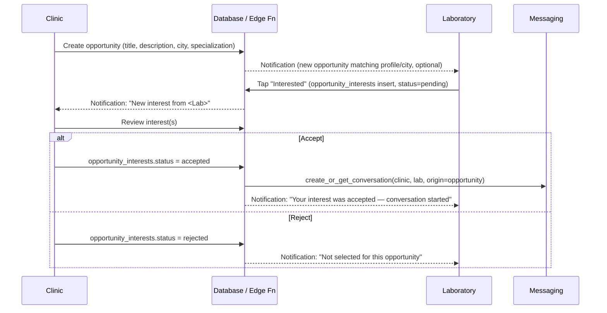

# 07 — Opportunities, Follow/Favorites, Reviews

## Part A — Opportunities / Collaboration Workflow

### Full workflow (client §11)

### States & permissions
- `opportunities.status`: `open → closed | filled | cancelled`. Only the authoring org
  (`is_clinic_manager`/`is_laboratory_manager`) can change it. **Confirmed by client
  (`16-client-decisions-mvp-scope-update.md` §2): multiple accepts are allowed.** An opportunity
  does **not** auto-close on the first `accepted` interest — the author can accept as many
  interested parties as they want and decides manually when to close it (`status='closed'` or
  `'filled'`), keeping collaboration flexible. `opportunity_interests` can therefore have several
  simultaneous `accepted` rows for the same opportunity.
- `opportunity_interests.status`: `pending → accepted | rejected`, or `pending → withdrawn` by the
  responder. Terminal states are immutable (no re-opening a rejected interest — the responder would
  need to wait for a new opportunity, avoiding endless back-and-forth spam).
- **Duplicate prevention:** `unique(opportunity_id, responder_type, responder_id)` at the DB level
  (see `02-database.md`) is the authoritative guard; the UI additionally disables the "Interested"
  button once a row exists, reading its current status.
- **Cancellation:** author can cancel an `open` opportunity at any time (`status=cancelled`); any
  `pending` interests are auto-transitioned to a terminal `rejected`-equivalent state
  (`withdrawn_by_system`, recommend adding this as an enum value) with a notification explaining why.
- **Blocking interaction:** a laboratory that has blocked a clinic (or vice versa) cannot see that
  clinic's opportunities in listings and cannot register interest — enforced the same way as the
  messaging block check.
- **Both directions supported:** clinics post "looking for a lab" opportunities *and* labs can post
  "available for new clinic collaborations" opportunities (client §11, last line) — modeled
  identically via `author_type` rather than two separate tables.

### Edge cases explicitly handled
- Opportunity author reviewing interests sees all `pending` + historical `accepted`/`rejected` in
  one list, sorted by submission time — never silently hides rejected ones (transparency for
  moderation/audit).
- A conversation created from an accepted interest is linked back
  (`opportunity_interests.conversation_id`) so both parties see the opportunity context pinned at
  the top of that chat.
- Reposting: if a clinic wants to reopen essentially the same search after cancelling, that's a new
  `opportunities` row, not a state resurrection — keeps the audit trail clean.

## Part B — Follow & Favorites

### Follow
Targets: clinics, dentists, laboratories (client §16, patients and orgs can all follow). Modeled as
a single `follows` table with `target_type`/`target_id` (see `02-database.md`), not per-entity-type
tables, so the "Following" screen is one query with a type filter rather than three unioned queries.
`unique(follower_user_id, target_type, target_id)` prevents duplicate follows; unfollow is a delete,
not a soft state, since there's no moderation value in retaining follow history the way there is for
reviews/reports.

### Favorites
Per client §18, favoriting scope differs by account type (patients save clinics/dentists/posts;
clinics save labs/dentists/posts; labs save clinics/posts) — implemented as one generic
`favorites` table with the same `target_type`/`target_id` pattern; **which target types are valid
for which account type is an application-layer/UI concern** (the "Favorite" button simply isn't
shown for invalid combinations), not a DB-level constraint, since the valid-combination matrix is a
product decision likely to evolve (e.g., allowing labs to eventually favorite dentists too) and
shouldn't require a migration to adjust.

### Follow vs Favorite vs Save — clarified distinction (for the coding agent)
| | Target | Visibility | Purpose |
|---|---|---|---|
| **Follow** | Clinic / Dentist / Laboratory only | Public (see note in `03-security.md`) | Ongoing relationship, drives feed ranking |
| **Favorite** | Clinic / Dentist / Laboratory / **Post** | Private, self-only | "My saved list" — general bookmarking |
| **Save** (feed interaction) | Post only | Private, self-only, but also drives the public `save_count` on the post | Lightweight feed engagement signal; kept in sync with Favorites for posts (see `02-database.md` §4 rationale) |

## Part C — Reviews

### Rules (client §20)
- Patients review clinics only (laboratory reviews explicitly deferred to a later phase per the
  spec — the schema reserves `rating_avg`/`rating_count` columns on `laboratories` already so this
  is additive later, not a breaking migration).
- 1–5 stars, optional category breakdown (communication, professionalism, overall experience).
- One review per patient per clinic (`unique(clinic_id, patient_user_id)`).
- Report review → feeds the shared `reports` table (`target_type='review'`).
- Admin can delete/hide a review (`status = hidden_by_admin`), which excludes it from the
  `rating_avg` recalculation trigger without physically deleting the row (retains audit trail).
- Anti-spam: beyond the one-per-patient constraint, recommend a **cooldown** on repeat review
  edits (e.g., editable only within 48h of creation, then locked except via admin) and monitoring
  for review-velocity anomalies (e.g., 10 five-star reviews for a clinic within an hour) as an
  admin-panel flag rather than a hard block — surfaced as a V1.5 anti-fraud enhancement.

### Rating calculation
`clinics.rating_avg`/`rating_count` are recalculated by an `AFTER INSERT OR UPDATE OR DELETE`
trigger on `reviews` scoped to `status = 'visible'` rows only, so hidden/reported-and-removed
reviews never pollute the public average — this is the single source of truth; no other code path
computes or caches ratings independently.
