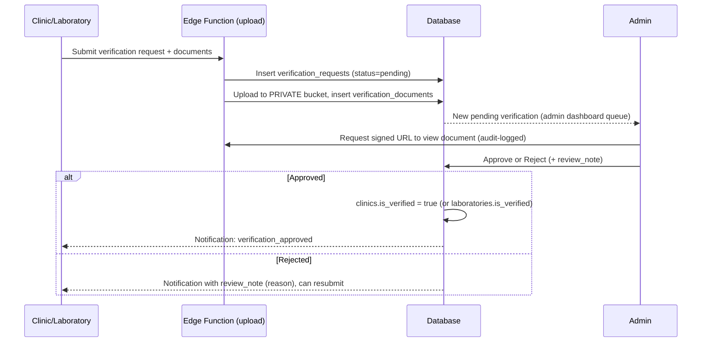

# 08 — Verification, Notifications, Blocking & Reporting

## Part A — Verification System

### Workflow (client §19)

### Rules
- **Document types — confirmed by client** (`16-client-decisions-mvp-scope-update.md` §6):
  | Subject | Required documents |
  |---|---|
  | Clinic | CUI (company registration certificate), Autorizație de funcționare de la DSP (Public Health Directorate operating authorization), CI (ID) of the legal representative |
  | Laboratory | CUI, certificate/diploma of the responsible dental technician, CI of the legal representative |

  `verification_documents.document_type` enum: `cui`, `dsp_authorization` (clinic-specific),
  `technician_certificate` (lab-specific), `id_document`, `other` (kept as an escape hatch — the
  client noted requirements may be refined once submissions are actually reviewed in practice).
- **Documents are never publicly or org-self readable after upload** — see `03-security.md` §4 for
  the exact enforcement mechanism (private bucket, no standing SELECT policy, admin-only
  signed-URL minting, audit-logged views).
- Resubmission: a rejected request allows a new `verification_requests` row (fresh submission), not
  mutation of the rejected one — preserves full history of prior attempts for admin context.
- Badge display: `clinics.is_verified`/`laboratories.is_verified` are denormalized booleans read by
  every profile card/marker/search result — kept in sync by an Edge Fn (not a raw trigger, since the
  transition also needs to fire a notification) whenever `verification_requests.status` moves to
  `approved`.

## Part B — Notification System

### Event catalog (client §21) → notification pipeline
| Event | Trigger | Recipient |
|---|---|---|
| `new_follower` | Insert into `follows` | Followed org's owner + admins |
| `new_like` | Insert into `likes` (target=post) | Post author org's owner + admins |
| `new_comment` | Insert into `comments` | Post author (+ parent-comment author if a reply) |
| `new_message` | Insert into `messages` | Other conversation member(s), only if not currently viewing that conversation (suppress push for the actively-open chat, still show in-app) |
| `collaboration_request` | Insert into `opportunity_interests` | Opportunity author org |
| `opportunity_response` | Update `opportunity_interests.status` to accepted/rejected | Responding org |
| `verification_approved` | Update `verification_requests.status` to approved | Subject org |
| `new_review` | Insert into `reviews` | Reviewed clinic's owner + admins |

### Pipeline
1. A Postgres trigger (`SECURITY DEFINER`, so it can write cross-user regardless of the acting
   user's own RLS grants — see `03-security.md`) inserts the `notifications` row synchronously on
   the relevant DB event, so in-app notification center is always consistent even if push delivery
   later fails.
2. That same trigger enqueues a push-dispatch job (lightweight `pg_notify` or a `push_queue` table
   polled by a scheduled Edge Function every ~10s) rather than sending push synchronously inside the
   DB transaction — keeps the triggering write fast and decouples push-provider latency/failures
   from the user-facing action.
3. The push-dispatch Edge Function checks `notification_preferences` for that user/event type before
   sending, looks up active `devices` rows, and calls the Expo Push API (batched).
4. In-app badge/list reads directly from `notifications` (RLS: self-only), marking `read_at` on
   view.

### Preferences & batching
- `notification_preferences` (one row per user, boolean per event type) — respected at
  dispatch-time, not just a UI-side filter.
- **Batching:** high-frequency events (likes, follows on a popular profile) are digested — the
  push-dispatch job coalesces multiple `new_like` notifications for the same recipient within a
  short window (e.g., 5 minutes) into a single push ("+12 new likes on your post") while still
  inserting individual `notifications` rows for the in-app list — prevents push-notification fatigue
  without losing in-app detail.
- **Deep links:** every notification's `target_type`/`target_id` maps to the same deep-link routes
  defined in `04-mobile.md` §2, so tapping a push takes the user directly to the relevant
  post/conversation/opportunity/profile.

## Part C — Blocking & Reporting

### Blocking
`blocked_users` is symmetric-in-effect though stored directionally (`blocker_user_id`,
`blocked_user_id`): once A blocks B, the enforcement layer treats it as mutual invisibility for
messaging (neither can message the other, per `06-feed-messaging.md`) and one-directional for
content visibility (B's public posts/profile remain visible to A on public surfaces like the feed
and search, since blocking is about stopping direct contact, not erasing a public professional
profile — a product decision worth confirming with the client; the alternative, fully mutual content
hiding, is a small config change if preferred).

### Reporting (client §26)
Single shared `reports` table (see `02-database.md` §10) covering profile, post, comment, message,
and review targets, with a fixed reason enum (spam, fake account, offensive content, scam,
inappropriate content, other) plus free-text `note`. Reporter identity is visible to admins (for
anti-abuse investigation, e.g. someone mass-reporting a competitor) but **never surfaced to the
reported party** — enforced by the RLS policy on `reports` (see `03-security.md`) and by simply
never including reporter identity in any notification sent to the reported user.

### Admin moderation queue
Reports feed a queue in the Admin Panel (`10-admin-panel.md`) sorted by `status='open'` then
recency, with the ability to bulk-view all reports against a single target (surfacing pattern abuse)
and to action directly from the report (hide content / suspend user / dismiss) — every action
writes both the `reports.status` update and an `audit_logs` entry.
