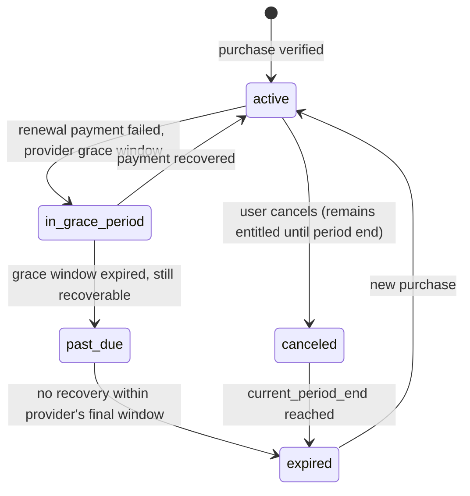

# 09 — Subscriptions & Payments Architecture

> **STATUS: DEFERRED FROM MVP/V1.** Confirmed by client
> (`16-client-decisions-mvp-scope-update.md` §5, §8): the app launches 100% free with no PRO plan
> and no payment processing for the first ~6–12 months, to focus on building the clinic/laboratory
> base. None of the tables/Edge Functions described in this document (`subscriptions`,
> `subscription_events`, `payments`, `plan_limits`, `clinics.plan`/`laboratories.plan`) are created
> in the MVP/V1 migration set — see `02-database.md` §11 for the much smaller MVP-scope
> `platform_limits` table that replaces plan-based limits for now. **This document remains the
> complete, ready-to-implement specification for when the monetization phase begins** — it is kept
> in full rather than deleted so no design work is lost; do not build any of this until the client
> explicitly triggers the monetization phase.

## 1. Plans (client §23)

| | FREE | PRO (monthly/annual) |
|---|---|---|
| Profile | ✅ | ✅ |
| Photos | Limited (e.g., N per portfolio item / total) | Extended limits |
| Feed | ✅ | ✅ + featured/highlighted placement |
| Search / Messages / Follow | ✅ | ✅ |
| Opportunities | Limited count/month | Extended/unlimited |
| Statistics | — | Profile view/engagement stats dashboard |
| Badge | — | PRO badge on profile/cards |
| Ranking priority | — | Priority boost in certain search/discovery result orderings |
| Promotion tools | — | Additional tools (e.g., boosted opportunity visibility) |

Exact numeric limits (photo counts, opportunity counts) are a pricing/product decision to be
finalized with the client before implementation — the architecture below treats all limits as
**config-driven, not hardcoded**, specifically so they can change without a redeploy:

```sql
create table plan_limits (
  plan text primary key,              -- 'free' | 'pro'
  max_portfolio_photos_per_item int,
  max_portfolio_items int null,        -- null = unlimited
  max_active_opportunities int,
  featured_placement boolean default false,
  stats_dashboard boolean default false
);
```

## 2. Core principle: server-verified entitlement, never client-trusted

The client explicitly requires this ("the backend must verify purchases and maintain subscription
state"). Concretely:
- The mobile client **never** sets `subscriptions.status` or `clinics.plan`/`laboratories.plan`
  directly — those columns have no client-facing `INSERT`/`UPDATE` RLS grant at all (see
  `03-security.md`).
- Every plan-gated feature check (upload limit, opportunity count, featured placement) reads
  `clinics.plan` (or the live `subscriptions` row) via a server-side RLS-protected query — the app
  UI may *also* hide affordances optimistically for good UX, but the authoritative gate is always a
  DB-level check (e.g., an `INSERT` trigger on `portfolio_media` that rejects the insert if it would
  exceed `plan_limits.max_portfolio_photos_per_item` for that org's current plan).

## 3. Platform-specific purchase flows

### Apple (StoreKit 2 via `react-native-iap`)
1. Client initiates purchase for a configured App Store Connect subscription product ID
   (`pro_monthly`, `pro_annual`).
2. On successful purchase, the client receives a signed transaction; it is sent to an Edge Function
   (`verify-apple-receipt`) which calls **Apple's App Store Server API** to verify the transaction
   server-side (never trusting the on-device JWS alone without server verification).
3. Edge Function upserts `subscriptions` (platform=`apple`, `platform_subscription_id` = original
   transaction id) and mirrors `plan` onto the owning `clinics`/`laboratories` row.
4. **Server Notifications V2**: Apple pushes renewal/cancellation/refund/grace-period events to a
   webhook Edge Function (`apple-server-notifications`), which is the authoritative ongoing source
   of truth for subscription state — not just the initial purchase call. Every event is logged to
   `subscription_events` (raw payload retained) before the derived state update, for auditability
   and replay if a bug is found in the state-derivation logic.

### Google (Play Billing v6 via `react-native-iap`)
Same pattern: initial purchase token verified server-side via the **Google Play Developer API**
(`purchases.subscriptions.get`), then ongoing state maintained via **Real-time Developer
Notifications (RTDN)** pushed to Google Pub/Sub → an Edge Function subscriber
(`google-rtdn-handler`), logged to `subscription_events`, mirrored to `subscriptions`/org `plan`.

### Stripe (web only)
Standard Stripe Checkout + Customer Portal for the marketing/web surface (if web self-serve
subscription purchase is offered — mobile-first per client, so this may be deferred to V1.5 unless
the client wants web purchase parity). Stripe webhooks (`checkout.session.completed`,
`customer.subscription.updated/deleted`) hit an Edge Function
(`stripe-webhook-handler`) with **signature verification** (`stripe.webhooks.constructEvent`)
before any write — rejects unsigned/forged webhook calls outright.

**Important App Store/Play compliance note for the coding agent:** digital subscriptions unlocking
in-app features (PRO tier) **must** use native IAP on iOS/Android per store policy — Stripe cannot
be used for this on the mobile app itself, only on the web surface. This is a hard platform
constraint, not a preference.

## 4. Subscription lifecycle states



`clinics.plan`/`laboratories.plan` is derived as `pro` for `{active, canceled (until period end),
in_grace_period}` and `free` otherwise — this derivation logic lives in one place (a Postgres
function `derive_effective_plan(subscription_row)`) reused by every trigger/Edge Function that
needs it, so the "is this org effectively PRO right now" question is never answered two different
ways in two different code paths.

## 5. Cancellation, expiration, grace period, refunds

- **Cancellation:** user cancels through the platform's native subscription management (Apple/Google
  settings) or Stripe's customer portal — the app does not implement its own cancellation flow that
  bypasses the platform (not allowed by store policy anyway); the app links out to the appropriate
  native subscription-management screen.
- **Grace period:** handled per-platform semantics (Apple/Google both offer a billing-retry grace
  window) — entitlement is **retained** during grace period (standard practice, avoids punishing
  users for a transient card decline) per the state diagram above.
- **Refunds:** Apple/Google refund notifications (via the same server-notification channels) trigger
  immediate entitlement revocation and a `payments.status='refunded'` record; Stripe refunds via the
  `charge.refunded` webhook similarly.
- **Expiration:** once no provider signal indicates renewed/recoverable status by
  `current_period_end`, `status` moves to `expired` and `plan` reverts to `free` — existing
  over-limit content (e.g., portfolio photos beyond the free limit) is **not deleted**, simply
  frozen (no new uploads allowed until back under the limit or re-subscribed) to avoid destructive,
  surprising data loss on lapse.

## 6. Admin visibility
Admin Panel's Subscriptions/Payments sections (client §25) read `subscriptions`, `payments`, and
`subscription_events` directly (admin RLS grants full read) for support/troubleshooting, including
the raw webhook payload history — critical for resolving "I paid but don't have PRO" support
tickets without needing to query Apple/Google/Stripe consoles directly for every case.
